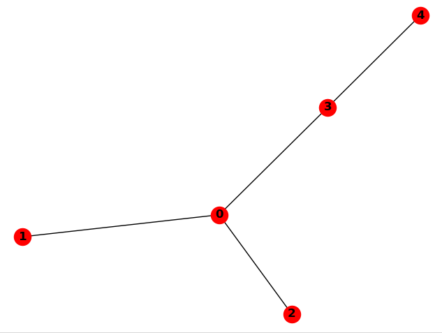

# What is Alearbres ?

Alearbres<sup>[1](#myfootnote1)</sup> is a collection of scripts that is intended to facilitate the generation of random dependency trees.

You can used Alearbres to generate artificial treebanks with various constraints :
+ random structures
+ random (projective and non-projective) linearisations
+ random linearisations that optimize for Dependency Length Minimization


# Main functionalities


## Creating random non-ordered dependency trees :

```python

# create a random tree with 5 nodes
>>> t = DependencyTree(5)
Tree
  Edges: [(1, 0), (2, 0), (3, 0), (4, 3)]
```

If you call the view method on the tree, you will get something like this:



```python
# transform it to conllu format
>>> tree = t.toTree()
# write it to a file
conll3.trees2conllFile([tree], "sample_random-trees.conllu")
```

Now if we want to build several trees at the same time, for example 10 trees of size 3 and 20 trees of size 20 :

```python
specs = {3:10, 4:20}
forest = build_random_forest(specs)
conll3.trees2conllFile(forest, "sample_random-forest.conllu")
```

## Randomly reordering nodes inside a dependency tree

```python
conll = """1	le	le	_	_	_	3	det	_	_
2	petit	petit	_	_	_	3	amod	_	_
3	chat	chat	_	_	_	4	subj	_	_
4	dort	dort	_	_	_	0	root	_	_
5	très	très	_	_	_	6	advmod	_	_
6	bien	bien	_	_	_	4	advmod	_	_
"""
tree = conll3.conll2tree(conll) # str -> Tree
random_tree = create_random_pj_linearisation(tree) # random linearisation + projective
r_nonproj = create_random_nonpj_linearisation(tree) # random linearisation

trees = [random_tree, r_nonproj]
conll3.trees2conllFile(trees, "sample_randomly-linearised-trees.conllu") # writes the conll to a file
```


## Optimally reordering nodes in a dependency tree with respect to Dependency Length Minimization


```python
conll = """1	le	le	_	_	_	3	det	_	_
2	petit	petit	_	_	_	3	amod	_	_
3	chat	chat	_	_	_	4	subj	_	_
4	dort	dort	_	_	_	0	root	_	_
5	très	très	_	_	_	6	advmod	_	_
6	bien	bien	_	_	_	4	advmod	_	_
"""
# store the dependency tree in a dict
>>> tree = conll3.conll2tree(conll)

# find the optimal sequence of nodes
>>> linearization = optimal_linearization(tree)
>>> print(linearization)
[6, 5, 1, 4, 3, 2]

# rewrite the conll according to the new linearisation
>>> new_tree = random_linearisation.rewrite_tree(tree, linearization)
	
# see the conll
>>> print(new_tree.conllu())
1       bien    bien    _       _       _       4       advmod  _       _
2       très    très    _       _       _       1       advmod  _       _
3       le      le      _       _       _       5       det     _       _
4       dort    dort    _       _       _       0       root    _       _
5       chat    chat    _       _       _       4       subj    _       _
6       petit   petit   _       _       _       5       amod    _       _
```

Note that this method only generate projective edges.

# Get the source


```
git clone https://github.com/marinecourtin/Alearbres.git
```

# Changelog

18/09/2019 : first release


_______________

<a name="myfootnote1">1</a> : **Alearbres** is a mashup of *aléatoire* and *arbres* (random trees in French)