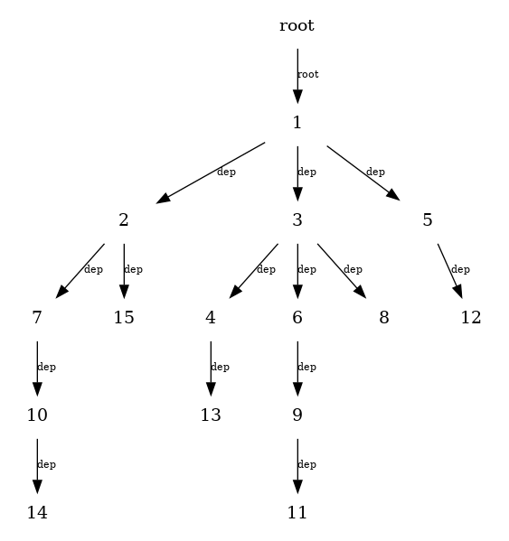
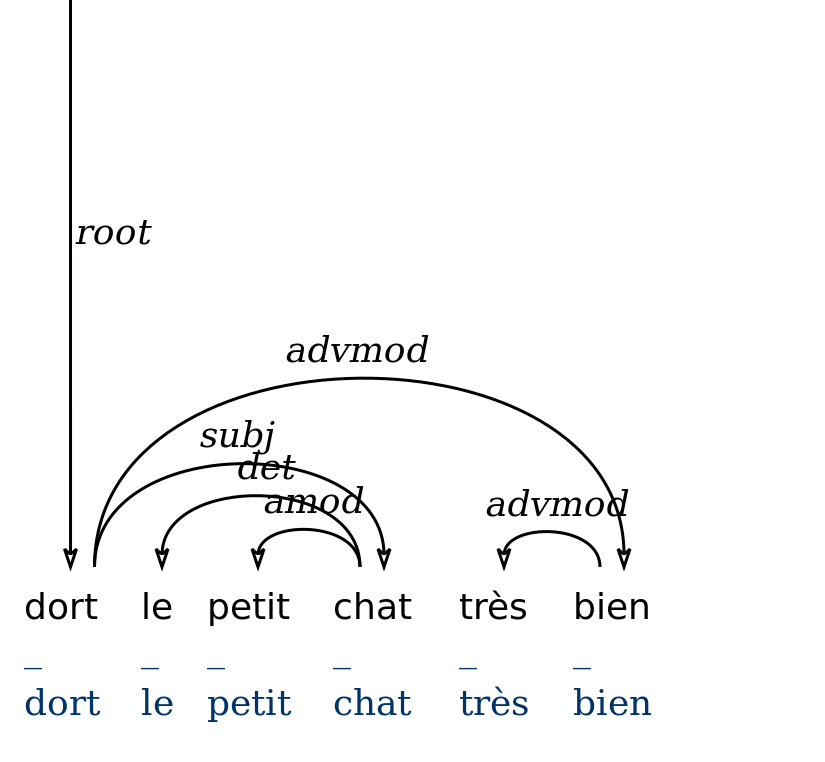
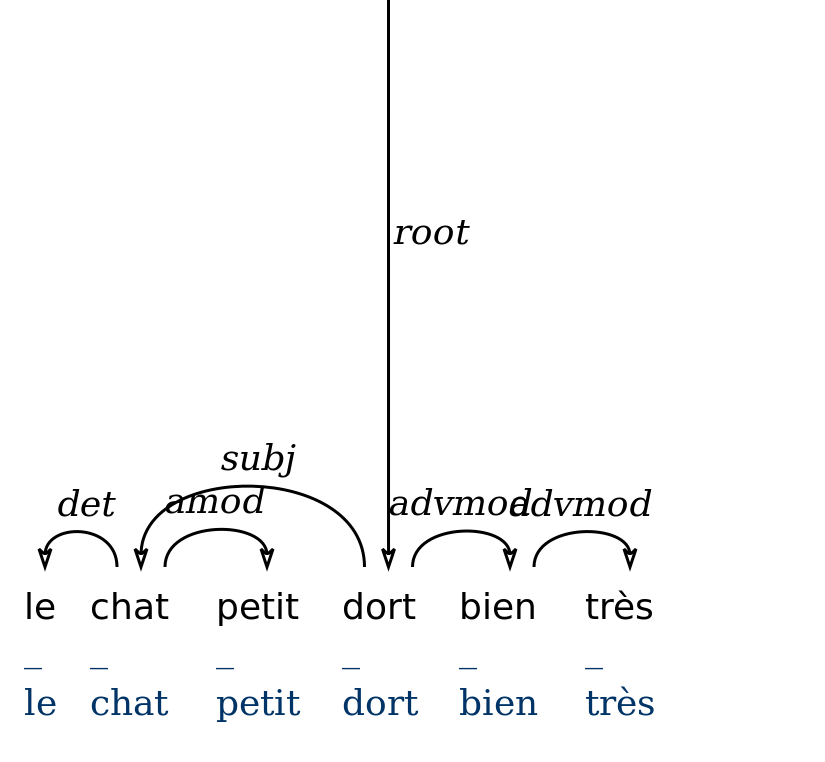

# What is Alearbres ?

Alearbres<sup>[1](#myfootnote1)</sup> is a collection of scripts that is intended to facilitate the generation of random dependency trees.

You can used Alearbres to generate artificial treebanks with various constraints :
+ random structures
+ random (projective and non-projective) linearisations
+ random linearisations that optimize for Dependency Length Minimization


# Main functionalities


## Creating random non-ordered dependency trees :

Main script : *random_structure.py*

```python

# create a random tree with 5 nodes
>>> t = DependencyTree(5)
Tree
	Edges: [(1, 0), (2, 1), (3, 0), (4, 2)]
```


```python
# transform it to conllu format
>>> tree = t.toTree()
# write it to a file
conll3.trees2conllFile([tree], "sample_random-trees.conllu")
```


You can visualize the tree as a stemma using the `draw_forest()` function from the script<sup>[2](#myfootnote2)</sup> `visualize_dependencies_udpipe.py`




```python
import visualize_dependencies_udpipe as visualize
visualize.draw_forest("sample_random-forest.conllu") 
```


Now if we want to build several trees at the same time, for example 10 trees of size 3 and 20 trees of size 20 :

```python
specs = {3:10, 4:20}
forest = build_random_forest(specs)
conll3.trees2conllFile(forest, "sample_random-forest.conllu")
```


## Randomly reordering nodes inside a dependency tree

Main script : *random_linearisation.py*


```python
>>> conll = """1	le	le	_	_	_	3	det	_	_
2	petit	petit	_	_	_	3	amod	_	_
3	chat	chat	_	_	_	4	subj	_	_
4	dort	dort	_	_	_	0	root	_	_
5	très	très	_	_	_	6	advmod	_	_
6	bien	bien	_	_	_	4	advmod	_	_
"""
>>> tree = conll3.conll2tree(conll) # transform the conll string into a tree format

# create random linearisations
>>> random_tree = create_random_pj_linearisation(tree) # projective
r_nonproj = >>> create_random_nonpj_linearisation(tree) # non-projective

# look at the projective tree
>>> tree
1	dort	dort	_	_	_	0	root	_	_
2	le	le	_	_	_	4	det	_	_
3	petit	petit	_	_	_	4	amod	_	_
4	chat	chat	_	_	_	1	subj	_	_
5	très	très	_	_	_	6	advmod	_	_
6	bien	bien	_	_	_	1	advmod	_	_
```

Which once translated into graphical format gives :



```python
# write the trees to a conll file
trees = [random_tree, r_nonproj]
conll3.trees2conllFile(trees, "sample_randomly-linearised-trees.conllu") 
```


## Optimally reordering nodes in a dependency tree with respect to Dependency Length Minimization

Main script : *dlm.py*


```python
conll = """1	le	le	_	_	_	3	det	_	_
2	petit	petit	_	_	_	3	amod	_	_
3	chat	chat	_	_	_	4	subj	_	_
4	dort	dort	_	_	_	0	root	_	_
5	très	très	_	_	_	6	advmod	_	_
6	bien	bien	_	_	_	4	advmod	_	_
"""
# store the dependency tree in a dict
>>> tree = conll3.conll2tree(conll)

# find the optimal sequence of nodes
>>> linearization = optimal_linearization(tree)
>>> print(linearization)
[1,3,2,4,6,5]
	
# rewrite the conll according to the new linearisation
>>> new_tree = random_linearisation.rewrite_tree(tree, linearization)
	
# see the conll
>>> print(new_tree.conllu())
1	le	le	_	_	_	2	det	_	_
2	chat	chat	_	_	_	4	subj	_	_
3	petit	petit	_	_	_	2	amod	_	_
4	dort	dort	_	_	_	0	root	_	_
5	bien	bien	_	_	_	4	advmod	_	_
6	très	très	_	_	_	5	advmod	_	_
```

Which gives us the nice tree below :



You can also of course use it on random trees to generate trees such as this one:


# There's some weird trees I would really like to generate but Alearbres does not cover them...

Great ! We're always interested in expanding the types of constraints that can be added during the generation process. If there is some specific constraint that you would be interested in, please submit a feature-request and we will look into it.

# Get the source


```
git clone https://github.com/marinecourtin/Alearbres.git
```

# Changelog

18/09/2019 : first release


_______________

<a name="myfootnote1">1</a> : **Alearbres** is a mashup of *aléatoire* and *arbres* (random trees in French)

<a name="myfootnote2">2</a> : This script was kindly provided by Peter Uhrig.